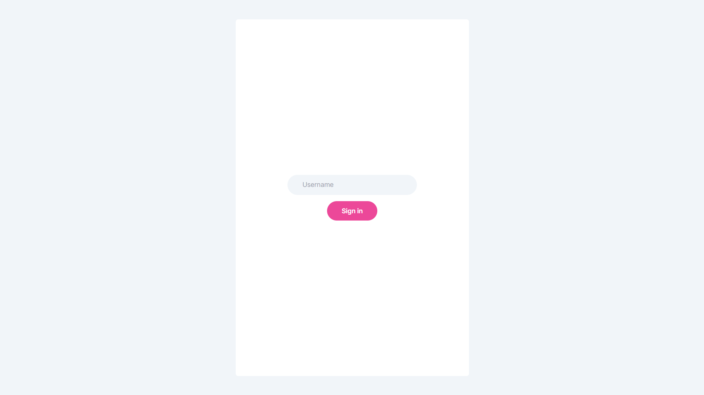
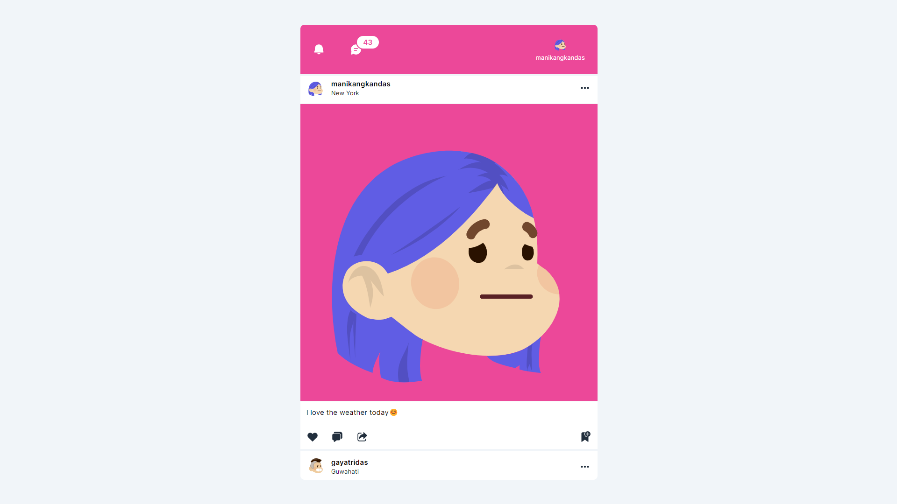
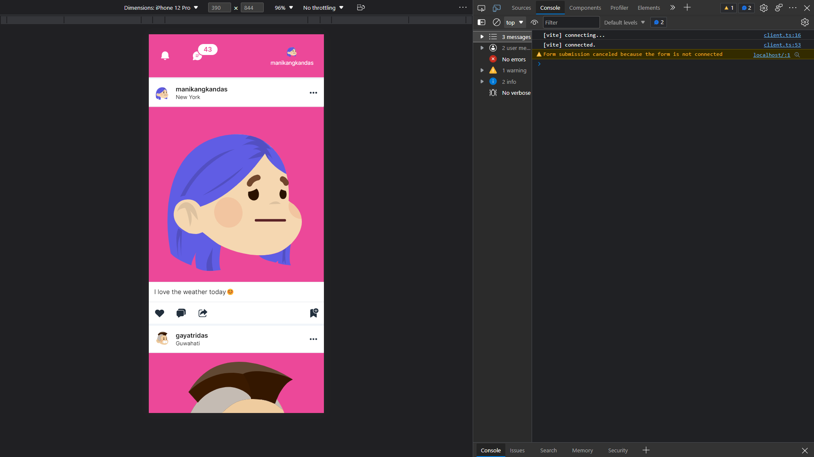

<div id="top"></div>

<!-- TABLE OF CONTENTS -->
<details>
  <summary>Table of Contents</summary>
  <ul>
    <li>
      <a href="https://manikangkandas.github.io/thread-comments/">View Demo</a>
    </li>
    <li>
      <a href="https://github.com/manikangkandas/thread-comments/issues">Report Bug</a>
    </li>
    <li>
      <a href="https://github.com/manikangkandas/thread-comments/issues">Request Feature</a>
    </li>
    <li>
      <a href="#about-the-project">About The Project</a>
      <ul>
        <li><a href="#built-with">Screenshots</a></li>
        <li><a href="#built-with">Built With</a></li>
      </ul>
    </li>
    <li>
      <a href="#getting-started">Getting Started</a>
      <ul>
        <li><a href="#prerequisites">Prerequisites</a></li>
        <li><a href="#installation">Installation</a></li>
      </ul>
    </li>
    <li><a href="#contributing">Contributing</a></li>
    <li><a href="#license">License</a></li>
    <li><a href="#contact">Contact</a></li>
  </ul>
</details>

<!-- ABOUT THE PROJECT -->

## 📢 About The Project

Real time alerts is a site of clear cut demonstration of how the so called real time alerts functionality works using web sockets.

Features -

- Like alerts
- Comment alerts.

<p align="right"><a href="#top">back to top</a></p>

## 💉 Screenshots





## 🏗️ Built With

- [Vite](https://vitejs.dev/)
- [React.js](https://reactjs.org/)
- [Tailwind CSS](https://tailwindcss.com/)
- [Socket.IO](https://socket.io/)

<p align="right"><a href="#top">back to top</a></p>

<!-- GETTING STARTED -->

## 🎊 Getting Started

On successful installation of prerequisites create a username amongst below -

- manikangkandas
- gayatridas
- dipambitabaishyadas

You will need to open two browser windows with two different username to see the effect of real time alerts. Then if you like or comment from both the side it will show your action as alert message under notification panel another side.

### ⚙️ Prerequisites

Prerequisites are listed below, install in order to run the project successfully in you local machine.

- node
- git
- browser  
- npm

  ```sh
  npm install npm@latest -g
  ```
  or
- yarn
  ```sh
  npm install --global yarn
  ```

### 🧑🏻‍🎤 Installation

1. Clone the repo
   ```sh
   git clone https://github.com/manikangkandas/thread-comments.git
   ```

2. Navigate to dir socket
    1. Install packages using NPM or YARN
        ```sh
        npm install
        ```
        or

        ```sh
        yarn add
        ```
    2. Run using NPM or YARN
        ```sh
        npm run dev
        ```
        or
        
        ```sh
        yarn dev
        ```
2. Open another terminal instance & navigate to dir client
    1. Install packages using NPM or YARN
        ```sh
        npm install
        ```
        or

        ```sh
        yarn add
        ```
    3. Run using NPM or YARN
        ```sh
        npm run dev
        ```
        or

        ```sh
        yarn dev
        ```

<p align="right"><a href="#top">back to top</a></p>

<!-- CONTRIBUTING -->

## 💁🏻‍♂️ Contributing

Contributions are what make the open source community such an amazing place to learn, inspire, and create. Any contributions you make are **greatly appreciated**.

If you have a suggestion that would make this better, please fork the repo and create a pull request. You can also simply open an issue with the tag "enhancement".
Don't forget to give the project a star! Thanks again!

1. Fork the Project
2. Create your Feature Branch `git checkout -b feature/AmazingFeature`
3. Commit your Changes `git commit -m 'Add some AmazingFeature'`
4. Push to the Branch `git push origin feature/AmazingFeature`
5. Open a Pull Request

<p align="right"><a href="#top">back to top</a></p>

<!-- LICENSE -->

## ©️ License

Distributed under the MIT License. See `LICENSE.txt` for more information.

<p align="right"><a href="#top">back to top</a></p>

<!-- CONTACT -->

## 🤝 Contact

Author Info - [@manikankandas](https://linkedin.com/in/manikangkandas) - manikangkan.das@outlook.com
<br />
Project Link - [https://github.com/manikangkandas/thread-comments](https://github.com/manikangkandas/thread-comments)

<p align="right"><a href="#top">back to top</a></p>
